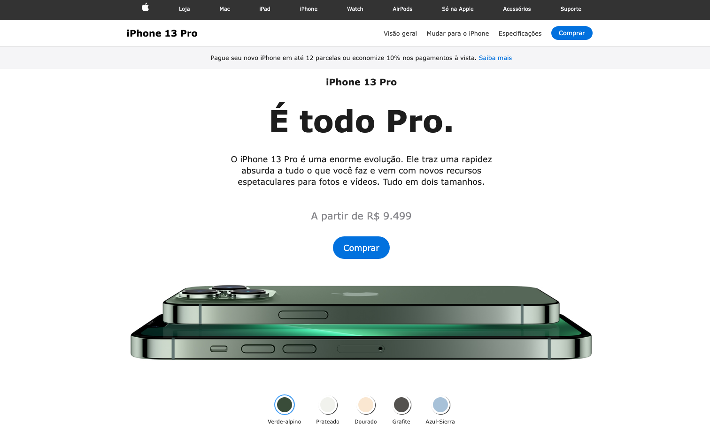

# 📱 iPhone 13 Clone

Uma reprodução visual do iPhone 13 desenvolvida com HTML e CSS, criada com o objetivo de praticar posicionamento de elementos, estilização avançada e responsividade.

## 🚀 Demonstração

### Preview



> Adicione um print da aplicação na pasta `assets`.

## 📖 Sobre o Projeto

Este projeto recria a interface visual de um iPhone 13 utilizando tecnologias web, focando em detalhes visuais, organização de componentes e boas práticas de desenvolvimento front-end.

## ✨ Funcionalidades

* Layout inspirado no iPhone 13
* Interface responsiva
* Estrutura organizada e sem dependências externas
* Desenvolvimento focado em HTML e CSS

## 🛠️ Tecnologias Utilizadas

* HTML5
* CSS3

## 📂 Estrutura do Projeto

```bash
iphone-13/
├── assets/
│   └── preview.png
├── css/
├── images/
├── index.html
└── README.md
```

## ⚙️ Como Executar

Clone o repositório:

```bash
git clone https://github.com/letotecdev/iphone-13.git
```

Entre na pasta do projeto:

```bash
cd iphone-13
```

Abra o arquivo `index.html` em seu navegador.

## 🎯 Objetivo

Este projeto foi desenvolvido para aprimorar habilidades em:

* Estruturação de páginas web
* Posicionamento com CSS
* Responsividade
* Reprodução de interfaces reais

## 🤝 Contribuições

Contribuições são sempre bem-vindas.

1. Faça um Fork do projeto.
2. Crie uma branch para sua feature.
3. Faça commit das alterações.
4. Abra um Pull Request.

## 📄 Licença

Este projeto está sob a licença MIT.

---

Desenvolvido por **LetoTec Dev** 🚀
